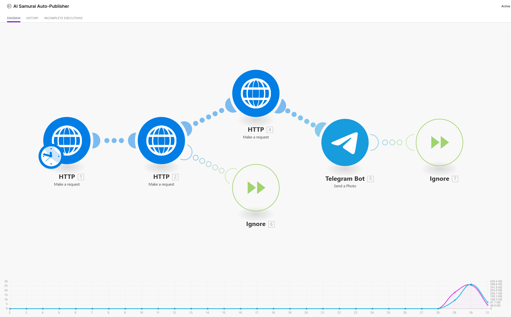
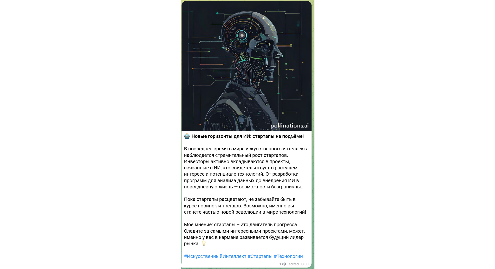
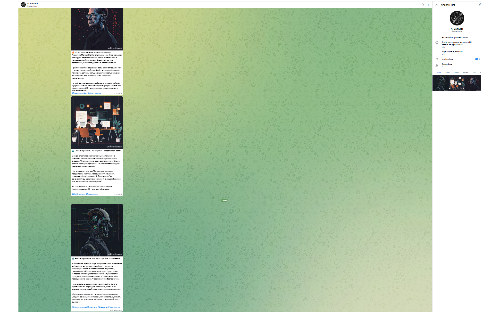

# AI Samurai Auto-Publisher 🤖⚔️

Автоматизированная система генерации и публикации контента об искусственном интеллекте в Telegram-канал.

## 📋 Описание проекта

**AI Samurai Auto-Publisher** — это no-code решение для автоматического ведения Telegram-канала об AI. Система собирает новости из RSS-лент, генерирует уникальные тексты в фирменном стиле с помощью OpenAI API, создаёт тематические изображения и публикует готовый контент по расписанию.

**Telegram-канал:** [@ai_samuray](https://t.me/ai_samuray)

## 🛠 Технологии

| Технология | Назначение |
|------------|------------|
| **Make.com** | Платформа автоматизации (no-code) |
| **OpenAI API** | Генерация текста (GPT-4o-mini) |
| **Pollinations.ai** | Генерация изображений (бесплатно) |
| **Telegram Bot API** | Публикация в канал |
| **RSS** | Источники новостей |

## 🏗 Архитектура

```
┌─────────────┐    ┌─────────────┐    ┌─────────────┐    ┌─────────────┐
│   HTTP [1]  │ →  │   HTTP [2]  │ →  │   HTTP [3]  │ →  │  Telegram   │
│  RSS Parser │    │   OpenAI    │    │ Pollinations│    │     Bot     │
└─────────────┘    └─────────────┘    └─────────────┘    └─────────────┘
      ↓                  ↓                  ↓                  ↓
   Новости         Текст поста         Картинка        Публикация
```

### Модули Make.com:

1. **HTTP [1]** — Парсинг RSS-ленты TechCrunch AI
2. **HTTP [2]** — Запрос к OpenAI API для генерации текста
3. **HTTP [3]** — Запрос к Pollinations.ai для генерации изображения
4. **Telegram Bot** — Отправка поста в канал @ai_samuray

## 💬 Промпт

### System Prompt:
```
Ты — AI Samurai, ведущий Telegram-канала об искусственном интеллекте. 
Твой стиль: спокойный, уверенный, прямой как катана. 
Объясняешь сложное простым языком. 
Добавляешь лёгкий ироничный юмор, но без клоунады. 
Никакого маркетингового тумана и хайпа.
```

### User Prompt:
```
Перепиши эту новость для Telegram-канала AI Samurai. 
Структура поста:
1) Эмодзи + цепляющий заголовок (не больше 7 слов)
2) Суть новости в 2-3 предложениях
3) Практический вывод для читателя
4) Твоё короткое мнение (1-2 предложения)
5) 2-3 хэштега на русском
Общий объём: 100-150 слов.
```

## ✅ Функциональность

- [x] Автоматический парсинг новостей из RSS
- [x] Генерация уникальных текстов (OpenAI GPT-4o-mini)
- [x] Генерация тематических изображений (Pollinations.ai)
- [x] Публикация в Telegram по расписанию
- [x] Обработка ошибок (Error Handlers)
- [ ] Множественные источники новостей
- [ ] Автоматическая аналитика вовлечённости

## 📸 Скриншоты

### Сценарий в Make.com


### Пример поста


### Канал @ai_samuray


## 💰 Экономика проекта

| Ресурс | Стоимость |
|--------|-----------|
| Make.com | Бесплатно (1000 операций/мес) |
| Pollinations.ai | Бесплатно |
| OpenAI API | ~$1-2/мес (при 30 постах) |
| **Итого** | **~100-200 руб/мес** |

## 🚀 Планы развития

1. Добавить RSS-источники: OpenAI Blog, Anthropic, Google AI
2. Создать рубрикатор с разными промптами
3. Интегрировать Telegram Analytics API
4. Масштабировать для коммерческих клиентов

## 👤 Автор

**Денис Гузняев**  
Prompt Engineer | No-code & AI enthusiast

- Telegram: [@ai_samuray](https://t.me/ai_samuray)
- GitHub: [@Dan-The-Creator](https://github.com/Dan-The-Creator)


